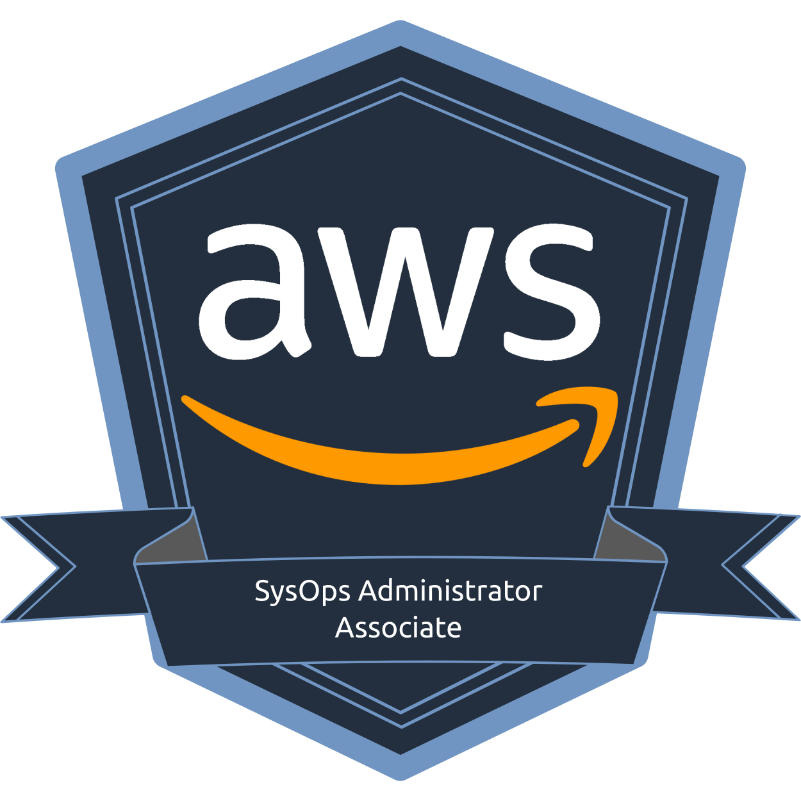
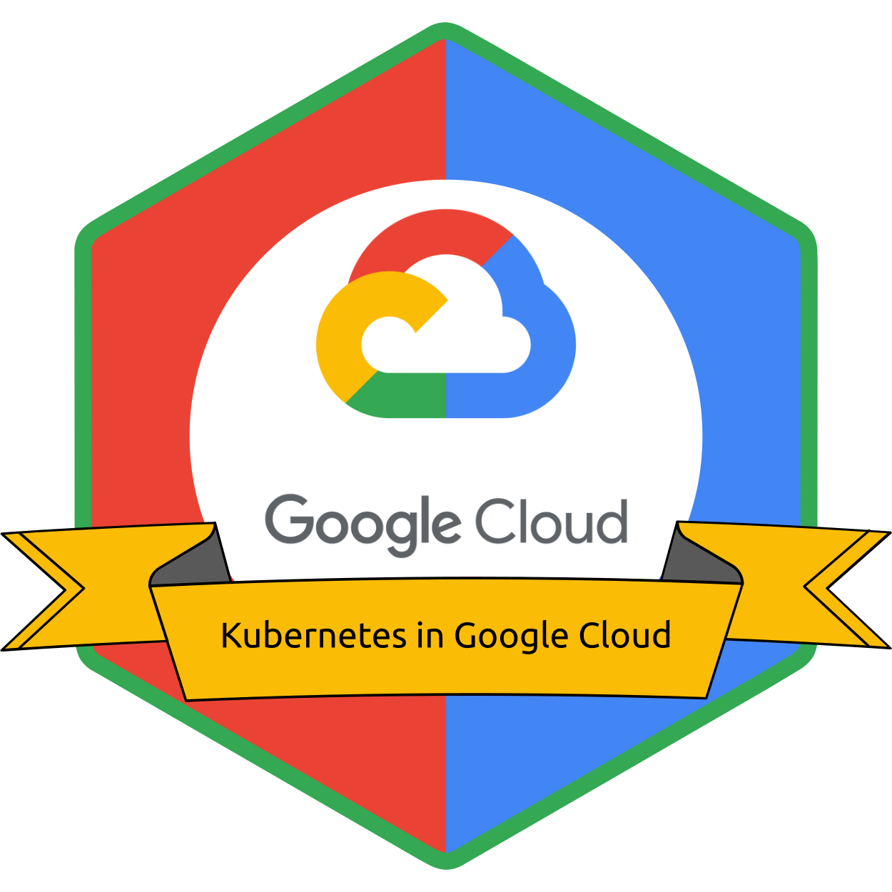
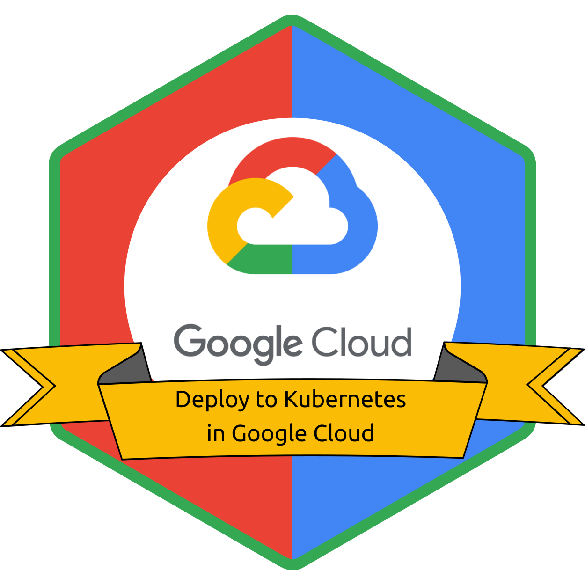

&emsp;&emsp;&emsp;&emsp;&emsp;&emsp;&emsp;&emsp;&emsp;&emsp;

## Badges

  
AWS

  

    
    &emsp;
    
    &emsp;
    
    &emsp;
    
    &emsp;
    
    &emsp;
    
    &emsp;
    
    &emsp;
    
    &emsp;
    
    &emsp;
  

  
GCP

  

    
    &emsp;
    
    &emsp;
    
    &emsp;
    
    &emsp;
    
    &emsp;
    
    &emsp;
    
    &emsp;
    
    &emsp;
  

